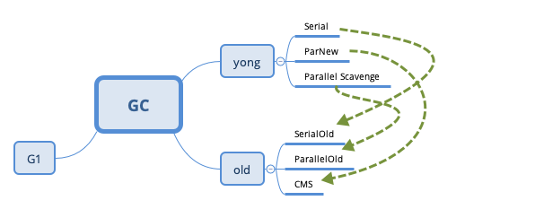

### homework2
1. 总结不同GC和堆内存  
2. 使用 HttpClient 或 OkHttp 访问 http://localhost:8801  

#### 总结不同GC和堆内存:
  
serial:  
最基本, 单线程, 需要暂停所有线程STW  
优点: 简单高效, 不能充分利用多核CPU适合单CPU  
缺点: 有STW, 不适合服务器  
yong= mark-copy  
old= mark-sweep-compact 

parallel: 
GC线程数默认为CPU数  
优点: 增加吞吐量, 适合多核CPU, 相对总暂停时间短    
缺点: 有STW, 老年代时间可能长    
yong= mark-copy  
old= mark-sweep-compact  

CMS: 
GC线程数默认为CPU数1/4  
避免在老年代垃圾收集时出现长时间的卡顿
1. 不对老年代进行整理，而是使用空闲列表(free-lists)来管理内存空间的回收  
2. 在 mark-and-sweep (标记-清除) 阶段的大部分工作和应用线程一起并发执行  
优点: 响应速度快, 降低GC停顿导致的系统延迟  
缺点: 处理老年代时，可能会伴随着多次年轻代的 minor GC  
yong= mark-copy  
old= mark-sweep  

G1:
将STW停顿的时间和分布，变成可预期且可配置的, 堆不再分成年轻代和老年代，而是划分为多个可以存放对象的小块堆区域(smaller heap regions)  
响应速度快, 面向服务端应用，将来替换CMS  
